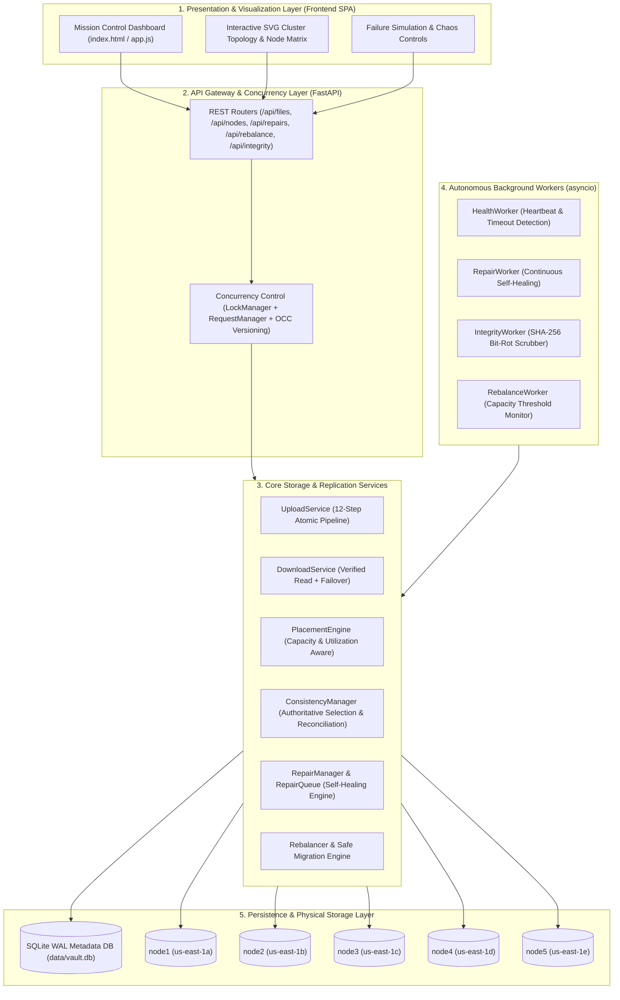

# NexStore VAULT — Distributed Object Storage System

**NexStore VAULT** is a fault-tolerant, self-healing distributed object storage system with a real-time mission-control visual dashboard. Designed for high availability, cryptographic data integrity, and operational observability, NexStore VAULT replicates binary and text objects across independent storage nodes, detects hardware crashes, network partitions, and silent bit-rot via SHA-256 checksums, and automatically heals degraded replicas without service interruption.

---

## Key Features (24 Core Capabilities)

1. **Multi-Node Distributed Object Storage**: Simulates 5 isolated storage nodes (`node1`–`node5`) across distinct rack/region fault domains (`us-east-1a` to `us-east-1e`).
2. **Configurable Replication Factor (`RF`)**: Dynamic cluster-wide and per-upload replication factor (`RF = 1` to `N` healthy nodes, default `RF = 3`).
3. **Smart Capacity & Utilization Placement Engine**: Selects healthy, connected target nodes sorted deterministically by lowest storage utilization ratio and available capacity.
4. **Atomic Temporary-File Write & Rename (`os.replace`)**: Prevents partial or torn writes on disk by writing to `.tmp` files and syncing via `os.fsync` before atomic rename.
5. **Cryptographic SHA-256 End-to-End Integrity**: Computes and verifies SHA-256 digests during upload, read retrieval, replication, repair, and background scrubbing.
6. **Zero-Downtime Read Failover**: Automatically detects missing or corrupted replicas during `GET /api/files/{object_id}` and seamlessly serves from the next verified healthy replica.
7. **On-Read Self-Healing Trigger**: Automatically flags corrupted replicas encountered during downloads and enqueues asynchronous repair jobs.
8. **Optimistic Concurrency Control (OCC) & Versioning**: Monotonically increments object versions (`v1`, `v2`, ...) and enforces `expected_version` checks to prevent lost updates (`HTTP 409 VERSION_CONFLICT`).
9. **Per-Object Reader-Writer Lock Coordination**: Thread-safe concurrent read lock sharing and exclusive write locking via `LockManager` and `RequestManager`.
10. **Authoritative Replica Selection**: Deterministically selects the highest-version replica with a verified SHA-256 digest as the source of truth for repairs and reconciliation.
11. **Permanent Node Failure Simulation (`FAILED`)**: Simulates catastrophic node crashes, marking hosted replicas `MISSING`, transitioning objects to `DEGRADED`, and triggering automatic re-replication.
12. **Network Partition Simulation (`PARTITIONED`)**: Distinguishes temporary network isolation (`UNAVAILABLE` replicas, metadata preserved) from permanent disk failure (`FAILED`).
13. **Post-Partition & Post-Recovery Reconciliation**: Automatically compares replica versions and SHA-256 hashes upon node reconnect/restore, resyncing `STALE` replicas or pruning redundant surplus copies when `RF` is already satisfied.
14. **Silent Bit-Rot / Disk Corruption Injection**: Built-in chaos engineering endpoint (`POST /api/files/{id}/corrupt`) that flips physical bytes on disk to demonstrate SHA-256 mismatch detection.
15. **Autonomous Self-Healing Repair Engine**: Background `repair_worker` and priority `RepairQueue` that execute both **in-place repairs** (for corrupted/stale replicas on online nodes) and **replacement node repairs** (for failed nodes).
16. **Sub-Millisecond to Millisecond Repair Telemetry**: Tracks `progress` (`0%` → `50%` → `85%` → `100%`), `duration_ms`, source/target nodes, and mean recovery latency (`MTTR`).
17. **Verified Cluster Storage Rebalancing**: Migrates replicas from heavily loaded nodes to under-utilized nodes using a **Copy → SHA-256 Verify → Metadata Swap → Source Delete** pipeline.
18. **Periodic Background Workers**: Asynchronous `asyncio` workers for Heartbeat Monitoring (`5s`), Self-Healing Repair (`3s`), SHA-256 Integrity Scrubbing (`30s`), and Storage Rebalancing.
19. **Thread-Safe SQLite WAL Metadata Store**: Uses Write-Ahead Logging (`PRAGMA journal_mode=WAL`) and foreign-key enforcement for durable, ACID-compliant metadata persistence.
20. **Real-Time Mission-Control Dashboard**: Interactive dark-mode enterprise SPA with 8 KPI cards, SVG cluster topology map, interactive failure injection controls, replica distribution matrix, and live event stream.
21. **4-Stage Upload Pipeline Visualizer**: Real-time progress tracking across `Uploading` → `SHA-256 Hashing` → `Replicating` → `Verifying`.
22. **Comprehensive Audit & Activity Log Stream**: Persistent chronological event log (`OBJECT_UPLOADED`, `NODE_FAILED`, `CORRUPTION_DETECTED`, `REPAIR_COMPLETED`, `REBALANCE_COMPLETED`, etc.) with severity filtering.
23. **Interactive Chaos & Failure Simulation Toolbar**: One-click buttons to fail nodes, trigger network partitions, inject bit-rot corruption, run full cluster SHA-256 scans, and rebalance storage.
24. **Production REST API & Automated Test Suite**: Complete OpenAPI/Swagger endpoints (`/docs`) backed by automated unit, integration, and chaos resilience tests (`pytest`).

---

## Layered System Architecture



---

## Complete Folder Structure

```text
d:\hackthon antigravity\
├── .env.example                      # Default environment variable template
├── requirements.txt                  # Python dependencies (FastAPI, Uvicorn, Pytest, etc.)
├── run.py                            # Application launcher script
├── README.md                         # Production documentation & 12-phase demo guide
├── backend/
│   ├── __init__.py
│   ├── config.py                     # Environment-driven cluster configuration
│   ├── database.py                   # Thread-safe SQLite WAL database manager & schema
│   ├── exceptions.py                 # Structured domain exceptions & HTTP status codes
│   ├── logging_config.py             # Structured console & rotating file logging
│   ├── main.py                       # FastAPI lifespan, routers, and static SPA mount
│   ├── models.py                     # Enums & dataclasses (NodeStatus, ReplicaStatus, etc.)
│   ├── schemas.py                    # Pydantic request/response validation schemas
│   ├── api/                          # REST API route modules
│   │   ├── activity.py               # GET /api/activity
│   │   ├── files.py                  # /api/files (upload, download, verify, corrupt, delete)
│   │   ├── health.py                 # GET /api/health
│   │   ├── integrity.py              # POST /api/integrity/scan
│   │   ├── nodes.py                  # /api/nodes (list, fail, restore, partition, reconnect)
│   │   ├── rebalance.py              # /api/rebalance (trigger & status)
│   │   ├── repair.py                 # /api/repairs (list, run, retry)
│   │   ├── replicas.py               # GET /api/replicas
│   │   └── system.py                 # /api/system/stats & /api/system/settings
│   ├── concurrency/                  # Read/write locks, active request metrics & OCC
│   │   ├── locks.py
│   │   ├── request_manager.py
│   │   └── versioning.py
│   ├── health/                       # Heartbeat pulse & timeout failure detection
│   │   ├── failure_detector.py
│   │   ├── health_checker.py
│   │   └── heartbeat.py
│   ├── integrity/                    # Cryptographic SHA-256 hashing & bit-rot scanner
│   │   ├── checksum.py
│   │   ├── corruption_detector.py
│   │   └── verifier.py
│   ├── metadata/                     # Object status calculation & metadata queries
│   │   ├── metadata_consistency.py
│   │   ├── metadata_manager.py
│   │   └── metadata_store.py
│   ├── rebalancing/                  # Verified zero-loss replica migration
│   │   ├── migration.py
│   │   └── rebalancer.py
│   ├── repair/                       # Self-healing queue & repair job execution
│   │   ├── repair_manager.py
│   │   ├── repair_queue.py
│   │   └── repair_worker.py
│   ├── replication/                  # Replica lifecycle, placement policy & reconciliation
│   │   ├── consistency.py
│   │   ├── placement_policy.py
│   │   ├── replica_manager.py
│   │   └── replicator.py
│   ├── services/                     # High-level orchestration services
│   │   ├── delete_service.py
│   │   ├── download_service.py
│   │   ├── node_service.py
│   │   ├── object_service.py
│   │   ├── repair_service.py
│   │   └── upload_service.py
│   ├── storage/                      # Physical filesystem abstraction & placement engine
│   │   ├── file_utils.py
│   │   ├── node_manager.py
│   │   ├── object_store.py
│   │   ├── placement.py
│   │   └── storage_metrics.py
│   └── workers/                      # Background asyncio tasks
│       ├── health_worker.py
│       ├── integrity_worker.py
│       ├── rebalance_worker.py
│       └── repair_worker.py
├── frontend/                         # Mission-Control Single Page Application
│   ├── index.html
│   ├── css/
│   │   ├── components.css
│   │   ├── dashboard.css
│   │   └── styles.css
│   └── js/
│       ├── api.js
│       ├── app.js
│       ├── charts.js
│       ├── components.js
│       ├── failureControls.js
│       ├── fileExplorer.js
│       ├── nodeVisualizer.js
│       ├── repairMonitor.js
│       └── upload.js
├── storage_nodes/                    # Isolated per-node physical directories
│   ├── node1/ (node.json, data/)
│   ├── node2/ (node.json, data/)
│   ├── node3/ (node.json, data/)
│   ├── node4/ (node.json, data/)
│   └── node5/ (node.json, data/)
├── data/
│   └── vault.db                      # SQLite WAL metadata database (auto-created)
├── docs/                             # Complete engineering documentation suite
│   ├── api.md
│   ├── architecture.md
│   ├── failure-handling.md
│   ├── recovery.md
│   ├── replication.md
│   └── system-design.md
└── tests/                            # Automated Pytest suite
    ├── test_concurrency.py
    ├── test_failure_recovery.py
    ├── test_integrity.py
    ├── test_rebalance.py
    ├── test_replication.py
    └── test_upload_download.py
```

---

## Requirements & Installation

### Prerequisites
- **Python**: `3.10+` (`3.11` or `3.12` recommended)
- **OS**: Windows, macOS, or Linux

### Installation Steps
```powershell
# 1. Navigate to the project root directory
cd "d:\hackthon antigravity"

# 2. (Optional) Create and activate a virtual environment
python -m venv .venv
.\.venv\Scripts\Activate.ps1

# 3. Install required dependencies
pip install -r requirements.txt
```

---

## Environment Configuration (`.env`)

Copy `.env.example` to `.env` (or rely on the built-in defaults in `backend/config.py`):

```ini
APP_NAME=NexStore VAULT
HOST=127.0.0.1
PORT=8000
NODE_COUNT=5
REPLICATION_FACTOR=3
HEALTH_CHECK_INTERVAL=5
HEARTBEAT_TIMEOUT=15
REPAIR_INTERVAL=3
INTEGRITY_CHECK_INTERVAL=30
REBALANCE_THRESHOLD=80
MAX_STORAGE_PER_NODE=10737418240
DATABASE_PATH=data/vault.db
STORAGE_ROOT=storage_nodes
AUTO_SCALE_ENABLED=true
MAX_AUTO_SCALE_NODES=12
SUPABASE_URL=https://your-project.supabase.co
SUPABASE_KEY=your-anon-or-service-key
```

### 1-Click Supabase Cloud Integration
NexStore VAULT supports real-time synchronization with Supabase PostgreSQL:
1. Open the UI at `http://127.0.0.1:8000/` and click the **☁ Connect Supabase** button in the top navigation.
2. Click **📋 Copy SQL Schema Script** and paste it into your **Supabase Dashboard > SQL Editor > Run** (or use the pre-made [`docs/supabase_schema.sql`](file:///d:/hackthon%20antigravity/docs/supabase_schema.sql)).
3. Enter your **Project URL** and **API Key**, then click **⚡ Test & Connect**.
4. The system automatically syncs all nodes, objects, replicas, and audit activity logs to Supabase in the background with zero performance impact on local operations.

---

## How to Run Backend & Frontend

The FastAPI server automatically serves both the REST API (`/api/*`, `/docs`) and the interactive Frontend Dashboard (`/`).

### Option A: Using the Launcher Script (Recommended)
```powershell
python run.py
```

### Option B: Using Uvicorn Directly (with Live Reload)
```powershell
uvicorn backend.main:app --reload --host 127.0.0.1 --port 8000
```

Once started, open your browser to:
- **Mission Control Dashboard**: `http://127.0.0.1:8000`
- **Interactive Swagger API Docs**: `http://127.0.0.1:8000/docs`
- **Health Summary Endpoint**: `http://127.0.0.1:8000/api/health`

---

## How to Run Tests

Run the full automated test suite (covering upload/download, replication placement, bit-rot detection, node failure self-healing, concurrency/versioning, and rebalancing):

```powershell
python -m pytest tests -v
```

---

## Complete 12-Phase Interactive Demo Workflow

Follow this step-by-step walkthrough during live demonstrations to showcase every capability of **NexStore VAULT**:

1. **Phase 1 — Cluster Initialization & Health Verification**:
   Open `http://127.0.0.1:8000`. Observe all 5 nodes (`NODE1`–`NODE5`) in `ONLINE` state with `100%` data integrity and `RF = 3`.
2. **Phase 2 — Multi-Stage Object Upload**:
   Upload a file via the **Upload Object** zone with Replication Factor `3`. Watch the 4-stage pipeline (`Uploading` → `SHA-256 Hashing` → `Replicating` → `Verifying`) complete and place replicas on `NODE1`, `NODE2`, and `NODE3`.
3. **Phase 3 — Replica Distribution Matrix Inspection**:
   In the **Object Explorer & Replica Matrix**, inspect the uploaded object's SHA-256 fingerprint, version (`v1`), and per-node badges (`NODE1: HEALTHY`, `NODE2: HEALTHY`, `NODE3: HEALTHY`).
4. **Phase 4 — Smart Load-Balanced Placement**:
   Upload a second file with `RF = 3`. Observe that the `PlacementEngine` automatically selects `NODE4` and `NODE5` first (since they have `0%` utilization) before `NODE1`, balancing storage across the cluster.
5. **Phase 5 — Silent Bit-Rot / Corruption Injection**:
   Click **Corrupt Replica** on an object (or `POST /api/files/{id}/corrupt`). Physical bytes on one storage node are altered on disk without updating metadata, simulating silent disk bit-rot.
6. **Phase 6 — Zero-Downtime Read Failover**:
   Click **Download** on the corrupted object. `DownloadService` computes the SHA-256 hash on the primary node, detects the mismatch, logs `CORRUPTION_DETECTED`, automatically fails over to a healthy replica (`X-Vault-Served-Node`), and delivers the intact file.
7. **Phase 7 — On-Demand & Autonomous In-Place Self-Healing**:
   Click **Verify / Scan Cluster** or watch the `Repair Monitor`. The corrupted replica is overwritten in-place from the authoritative healthy replica, SHA-256 verified, and restored to `HEALTHY`.
8. **Phase 8 — Catastrophic Node Failure (`FAILED`) & Replacement Replication**:
   Click **Fail Node** on `NODE1`. `NODE1` transitions to `FAILED`, its replicas become `MISSING`, and the `RepairManager` immediately copies affected objects from surviving nodes (`NODE2`/`NODE3`) onto a healthy replacement node (`NODE4` or `NODE5`) to restore `RF = 3`.
9. **Phase 9 — Node Recovery & Surplus Replica Pruning**:
   Click **Restore Node** on `NODE1`. `ConsistencyManager.reconcile_node_replicas` runs automatically: because `RF = 3` was already satisfied on replacement nodes during the outage, `NODE1` prunes its redundant stale replicas to prevent storage bloat.
10. **Phase 10 — Network Partition (`PARTITIONED`) vs Permanent Failure**:
    Click **Partition Node** on `NODE2`. Notice that `NODE2` enters `PARTITIONED` (`WARNING`) state and its replicas are marked `UNAVAILABLE` rather than destroyed. Click **Reconnect Node** to reconcile versions and checksums.
11. **Phase 11 — Optimistic Concurrency & Version Upgrade (`v1` → `v2`)**:
    Re-upload a modified file with the same filename or `object_id`. Observe the object version increment to `v2`, updating all target replicas atomically with a new SHA-256 digest.
12. **Phase 12 — Verified Cluster Storage Rebalancing**:
    Click **Trigger Rebalance** (`POST /api/rebalance`). The `Rebalancer` migrates replicas from the most utilized node to the least utilized node using verified copy-then-delete semantics.

---

## Failure Simulation Guide

| Failure Scenario | Dashboard Action | REST API Endpoint | Expected System Behavior |
| :--- | :--- | :--- | :--- |
| **Hard Node Crash** | Node Card → **Fail Node** | `POST /api/nodes/{node_id}/fail` | Node marked `FAILED`; replicas marked `MISSING`; objects marked `DEGRADED`; replacement replicas created on surviving nodes. |
| **Node Recovery** | Node Card → **Restore** | `POST /api/nodes/{node_id}/restore` | Node marked `ONLINE`; replicas reconciled against authoritative version/SHA-256; surplus replicas pruned. |
| **Network Partition** | Node Card → **Partition** | `POST /api/nodes/{node_id}/partition` | Node marked `PARTITIONED`; replicas marked `UNAVAILABLE` (metadata preserved); reads route around partitioned node. |
| **Partition Healing** | Node Card → **Reconnect** | `POST /api/nodes/{node_id}/reconnect` | Node marked `ONLINE`; stale replicas updated from authoritative copy; valid replicas restored to `HEALTHY`. |
| **Silent Bit-Rot** | File Row → **Corrupt** | `POST /api/files/{object_id}/corrupt` | Physical file on 1 replica node is mutated; SHA-256 scan or read failover flags `CORRUPTED` and schedules in-place repair. |

---

## Troubleshooting & Requirement-to-Implementation Mapping

### Common Troubleshooting
- **Port `8000` already in use**: Change `PORT=8001` in `.env` or run `uvicorn backend.main:app --port 8001`.
- **Resetting cluster state to clean factory defaults**: Stop the server, delete `data/vault.db` and `storage_nodes/node*/data/*`, and restart `python run.py`. The schema and 5 nodes are automatically recreated on startup.
- **`InsufficientNodesError (HTTP 400)` during upload**: Ensure the number of `ONLINE` + `CONNECTED` nodes is greater than or equal to the requested `replication_factor`.

### Requirement-to-Implementation Mapping Table

| Core Requirement | Implementation Module(s) | Key Classes / Functions |
| :--- | :--- | :--- |
| **Distributed Multi-Node Storage** | [`backend/storage/node_manager.py`](file:///d:/hackthon%20antigravity/backend/storage/node_manager.py), [`backend/storage/object_store.py`](file:///d:/hackthon%20antigravity/backend/storage/object_store.py) | `NodeManager`, `ObjectStore` |
| **Configurable Replication & Smart Placement** | [`backend/storage/placement.py`](file:///d:/hackthon%20antigravity/backend/storage/placement.py), [`backend/replication/replica_manager.py`](file:///d:/hackthon%20antigravity/backend/replication/replica_manager.py) | `PlacementEngine.select_nodes_for_object`, `ReplicaManager` |
| **SHA-256 Checksum & Bit-Rot Detection** | [`backend/integrity/checksum.py`](file:///d:/hackthon%20antigravity/backend/integrity/checksum.py), [`backend/services/object_service.py`](file:///d:/hackthon%20antigravity/backend/services/object_service.py) | `compute_sha256_file`, `ObjectService.verify_object` |
| **Zero-Downtime Read Failover** | [`backend/services/download_service.py`](file:///d:/hackthon%20antigravity/backend/services/download_service.py) | `DownloadService.retrieve_object` |
| **Self-Healing Repair Queue & Worker** | [`backend/repair/repair_manager.py`](file:///d:/hackthon%20antigravity/backend/repair/repair_manager.py), [`backend/repair/repair_queue.py`](file:///d:/hackthon%20antigravity/backend/repair/repair_queue.py) | `RepairManager.execute_repair_job`, `RepairQueue` |
| **Replica Consistency & Reconciliation** | [`backend/replication/consistency.py`](file:///d:/hackthon%20antigravity/backend/replication/consistency.py) | `ConsistencyManager.reconcile_node_replicas` |
| **Optimistic Concurrency & Locking** | [`backend/concurrency/locks.py`](file:///d:/hackthon%20antigravity/backend/concurrency/locks.py), [`backend/concurrency/versioning.py`](file:///d:/hackthon%20antigravity/backend/concurrency/versioning.py) | `LockManager`, `validate_expected_version` |
| **Verified Storage Rebalancing** | [`backend/rebalancing/rebalancer.py`](file:///d:/hackthon%20antigravity/backend/rebalancing/rebalancer.py), [`backend/rebalancing/migration.py`](file:///d:/hackthon%20antigravity/backend/rebalancing/migration.py) | `Rebalancer.run_rebalance`, `migrate_replica_safely` |
