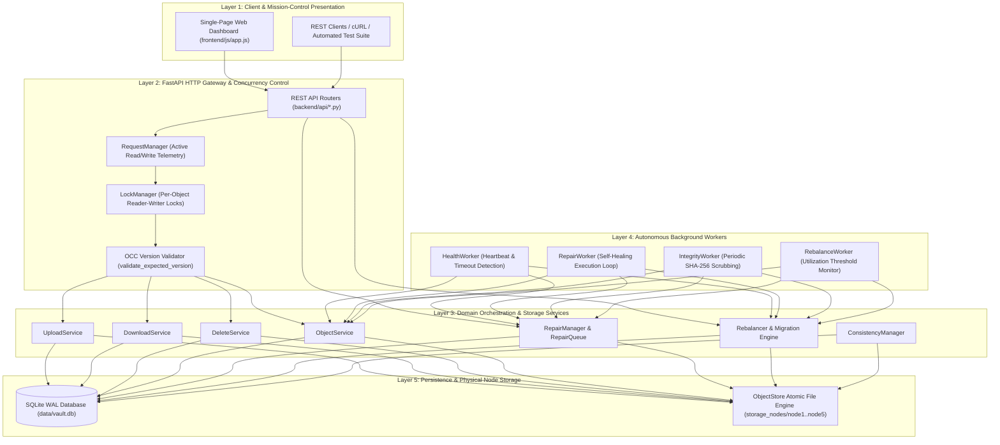
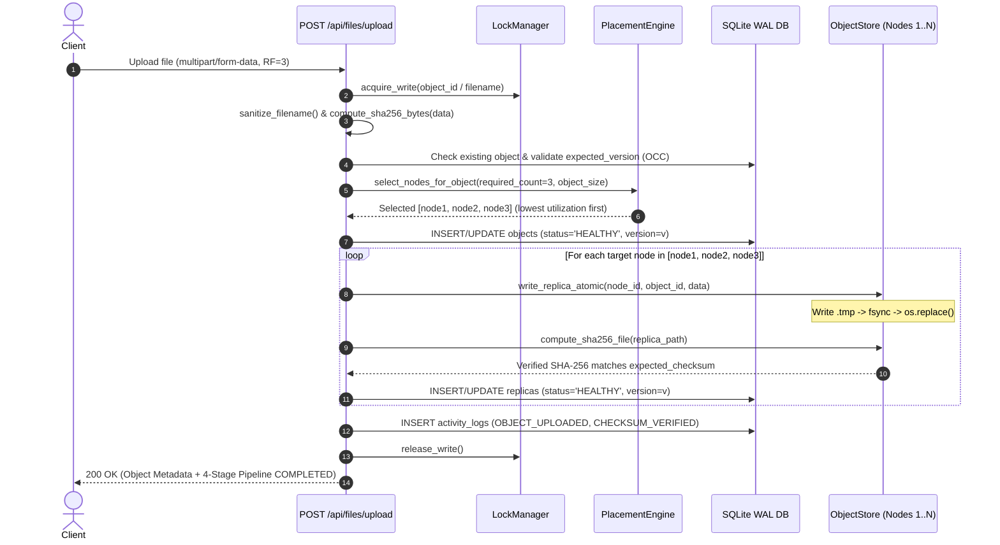
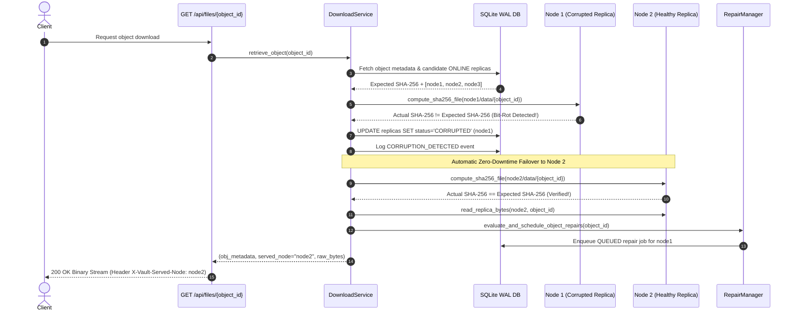
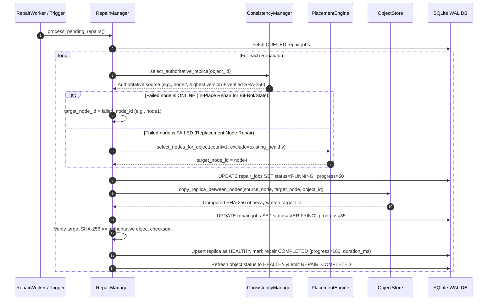
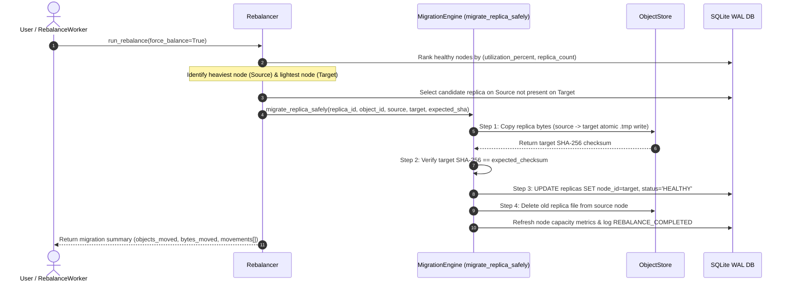

# NexStore VAULT — System Architecture

This document details the layered architecture, component responsibilities, and end-to-end execution sequence diagrams for **NexStore VAULT**.

---

## 1. Layered Architecture Overview

NexStore VAULT is structured into five decoupled architectural layers:

---

## 2. Component Responsibilities

| Component | Module Path | Core Responsibility |
| :--- | :--- | :--- |
| **FastAPI Application & Lifespan** | [`backend/main.py`](file:///d:/hackthon%20antigravity/backend/main.py) | Initializes SQLite WAL schema, bootstraps the 5 storage nodes, spawns the 4 background `asyncio` workers, and mounts the REST routers and static SPA assets. |
| **DatabaseManager** | [`backend/database.py`](file:///d:/hackthon%20antigravity/backend/database.py) | Thread-safe SQLite connection manager configured with `PRAGMA journal_mode=WAL`, `PRAGMA foreign_keys=ON`, and `RLock`-guarded transactional context managers. |
| **NodeManager** | [`backend/storage/node_manager.py`](file:///d:/hackthon%20antigravity/backend/storage/node_manager.py) | Manages physical node directories (`storage_nodes/node1..5`), node descriptors (`node.json`), capacity calculations, and state transitions (`ONLINE`, `FAILED`, `PARTITIONED`). |
| **ObjectStore** | [`backend/storage/object_store.py`](file:///d:/hackthon%20antigravity/backend/storage/object_store.py) | Performs atomic disk writes via temporary `.tmp` files, `os.fsync()`, and `os.replace()` to guarantee zero partial files on power loss or crash. |
| **PlacementEngine** | [`backend/storage/placement.py`](file:///d:/hackthon%20antigravity/backend/storage/placement.py) | Selects `K` distinct healthy, connected nodes with sufficient free space, prioritized by lowest storage utilization ratio. |
| **UploadService** | [`backend/services/upload_service.py`](file:///d:/hackthon%20antigravity/backend/services/upload_service.py) | Orchestrates filename sanitization, per-object write locking, OCC version checks, SHA-256 calculation, multi-node replica persistence, and post-write verification. |
| **DownloadService** | [`backend/services/download_service.py`](file:///d:/hackthon%20antigravity/backend/services/download_service.py) | Acquires shared read locks, verifies replica SHA-256 digests before returning bytes, transparently fails over on corruption/offline nodes, and queues background repairs. |
| **ConsistencyManager** | [`backend/replication/consistency.py`](file:///d:/hackthon%20antigravity/backend/replication/consistency.py) | Selects authoritative replicas (`highest version + matching SHA-256`) and reconciles nodes recovering from failure or network partitions. |
| **RepairManager & RepairQueue** | [`backend/repair/repair_manager.py`](file:///d:/hackthon%20antigravity/backend/repair/repair_manager.py) | Deduplicates repair jobs, executes in-place or replacement node copies, verifies SHA-256 digests, and records repair latency (`duration_ms`). |
| **Rebalancer** | [`backend/rebalancing/rebalancer.py`](file:///d:/hackthon%20antigravity/backend/rebalancing/rebalancer.py) | Redistributes replicas from high-utilization nodes to low-utilization nodes without dropping below the target replication factor. |

---

## 3. Sequence Diagrams

### 3.1 Fault-Tolerant Object Upload & Replication Sequence

---

### 3.2 Verified Object Download & Zero-Downtime Read Failover Sequence

---

### 3.3 Autonomous Self-Healing Repair Sequence

---

### 3.4 Verified Storage Rebalancing Sequence

