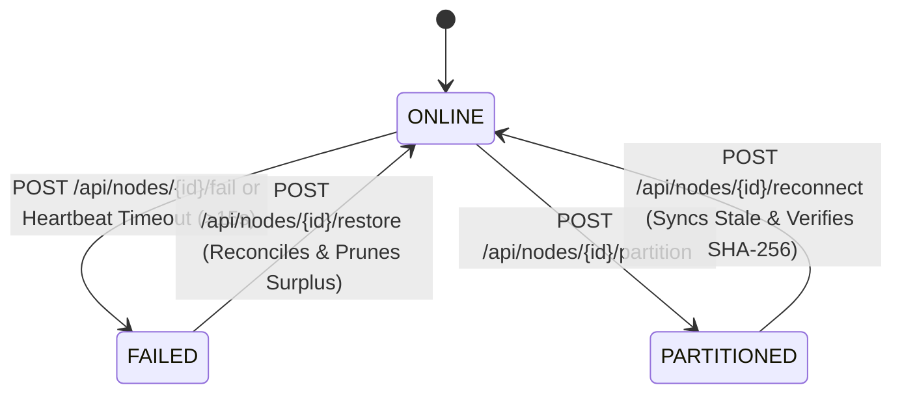

# NexStore VAULT — Failure Handling & Fault Tolerance

This document details how **NexStore VAULT** monitors node health, distinguishes permanent node crashes (`FAILED`) from temporary network partitions (`PARTITIONED`), detects silent bit-rot corruption via SHA-256 verification, and executes transparent read failover.

---

## 1. Heartbeat Monitoring & Timeout Detection

Implemented in [`backend/health/heartbeat.py`](file:///d:/hackthon%20antigravity/backend/health/heartbeat.py), [`backend/health/failure_detector.py`](file:///d:/hackthon%20antigravity/backend/health/failure_detector.py), and [`backend/workers/health_worker.py`](file:///d:/hackthon%20antigravity/backend/workers/health_worker.py):

1. **Heartbeat Pulse (`HEALTH_CHECK_INTERVAL = 5s`)**:
   Every 5 seconds, the background `health_worker` executes `health_checker.run_health_cycle()`.
2. **Active Node Liveness**:
   All nodes with `status == 'ONLINE'` and `network_status == 'CONNECTED'` emit a heartbeat that updates their `last_heartbeat` UTC timestamp in SQLite and refreshes their physical disk utilization metrics.
3. **Automatic Timeout Failure Detection (`HEARTBEAT_TIMEOUT = 15s`)**:
   `FailureDetector.check_timeouts()` inspects every `ONLINE` node and calculates:
   $$\Delta t = t_{\text{now}} - t_{\text{last\_heartbeat}}$$
   If $\Delta t > \texttt{HEARTBEAT\_TIMEOUT}$ (`15s`), the detector automatically invokes `node_manager.fail_node(node_id, auto_repair=True)`, transitioning the node to `FAILED` and triggering cluster self-healing.

---

## 2. Failure Detection: `FAILED` vs. `PARTITIONED`

NexStore VAULT explicitly models the operational distinction between a **permanent hardware/disk crash (`FAILED`)** and a **temporary network split (`PARTITIONED`)**:

| Characteristic | Permanent Node Failure (`FAILED`) | Temporary Network Partition (`PARTITIONED`) |
| :--- | :--- | :--- |
| **Trigger API** | `POST /api/nodes/{node_id}/fail` | `POST /api/nodes/{node_id}/partition` |
| **Node Status** | `status = FAILED`, `network_status = DISCONNECTED`, `health_status = CRITICAL` | `status = PARTITIONED`, `network_status = PARTITIONED`, `health_status = WARNING` |
| **Replica Status** | Marked `MISSING` (assumed lost on failed hardware) | Marked `UNAVAILABLE` (physical data still intact on isolated node, metadata preserved) |
| **Immediate Replacement Repair** | **Yes** — `RepairManager` immediately schedules and executes replacement replication onto healthy surviving nodes to restore $RF$. | **Deferred / Monitored** — Object status transitions to `DEGRADED` while isolated; upon `reconnect`, replicas are reconciled in-place. |
| **Recovery Action** | `POST /api/nodes/{node_id}/restore` — Reconciles node and **prunes surplus replicas** if $RF$ was already satisfied elsewhere during the outage. | `POST /api/nodes/{node_id}/reconnect` — Verifies SHA-256 and version; **resyncs `STALE` replicas** if the object was updated (`v1` $\to$ `v2`) during the partition. |

---

## 3. Silent Bit-Rot & Corruption Detection

Traditional filesystems can suffer from silent media degradation (bit-rot) where file size and timestamps appear normal, but underlying bytes are altered. NexStore VAULT detects bit-rot at three checkpoints:

1. **Read-Time Verification (`DownloadService.retrieve_object`)**:
   Every `GET /api/files/{object_id}` recomputes the SHA-256 hash of the physical replica file before streaming bytes to the caller.
2. **On-Demand Object Verification (`POST /api/files/{object_id}/verify`)**:
   Recomputes the SHA-256 checksum across all replicas of a specific object and compares each against the authoritative `objects.checksum`.
3. **Periodic & Full-Cluster Scrubbing (`POST /api/integrity/scan` & `integrity_worker`)**:
   Runs automatically every `INTEGRITY_CHECK_INTERVAL` (`30s`) or on-demand from the dashboard. Iterates over every object in the cluster, flags any replica whose disk SHA-256 mismatches `objects.checksum` as `ReplicaStatus.CORRUPTED`, emits a `CORRUPTION_DETECTED` event, and enqueues an in-place repair job.

---

## 4. Zero-Downtime Read Failover

When a client downloads an object (`GET /api/files/{object_id}`), `DownloadService` executes a resilient multi-replica failover loop:

1. Query all candidate replicas on `ONLINE` + `CONNECTED` nodes, prioritized by `status == 'HEALTHY'`, highest `version`, and `node_id`.
2. Inspect candidate #1 (e.g., `node1`):
   - If the physical file is missing, mark the replica `MISSING` and continue to candidate #2.
   - Compute `actual_checksum = compute_sha256_file(path)`.
   - If `actual_checksum != expected_checksum` or `replica.version != object.version`:
     - Mark the replica `CORRUPTED` in SQLite.
     - Emit a high-priority `CORRUPTION_DETECTED` activity event.
     - Immediately fail over to candidate #2 (`node2`) within the same HTTP request.
3. Once a candidate passes SHA-256 and version verification:
   - Trigger `repair_manager.evaluate_and_schedule_object_repairs(object_id)` so the corrupted replica discovered during the read is healed asynchronously.
   - Return the verified bytes with response header `X-Vault-Served-Node: node2` and `X-Vault-Checksum`.

---

## 5. Graceful Degradation Levels

NexStore VAULT dynamically computes both **Object Health** (`metadata_consistency.refresh_object_status`) and **Cluster Health** (`health_checker.get_health_summary`):

| Healthy Online Replicas ($H$) vs Target ($RF$) | Object Status | Read Availability | Self-Healing Action |
| :--- | :--- | :--- | :--- |
| $H \ge RF$ and $0$ corrupted | `HEALTHY` | **100% Available** | None required. |
| $1 \le H < RF$ (Node failed or partitioned) | `DEGRADED` | **100% Available** (via surviving replicas) | Automatic replacement or reconciliation repair queued. |
| $H \ge 1$ with $\ge 1$ replica `CORRUPTED` | `CORRUPTED` / `DEGRADED` | **100% Available** (via automatic read failover) | In-place repair overwrites corrupted replica from authoritative copy. |
| $H = 0$ (All nodes hosting object are offline/corrupted) | `UNAVAILABLE` | **HTTP 503 (`STORAGE_UNAVAILABLE`)** | Recovers automatically as soon as at least 1 node with a valid replica is restored/reconnected. |
