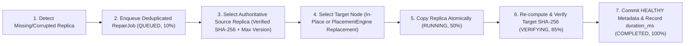

# NexStore VAULT — Self-Healing Recovery & Storage Rebalancing

This document describes the autonomous repair queue and worker pipeline, the distinction between in-place and replacement node repairs, recovery time metrics (`duration_ms`), and verified zero-loss storage rebalancing.

---

## 1. Self-Healing Repair Queue & Worker Workflow

NexStore VAULT continuously maintains object durability through two collaborating components:
- **`RepairQueue` ([`backend/repair/repair_queue.py`](file:///d:/hackthon%20antigravity/backend/repair/repair_queue.py))**: Manages durable SQLite `repair_jobs` entries with automatic deduplication so that multiple concurrent detections of the same degraded replica do not spawn duplicate repair tasks.
- **`RepairManager` ([`backend/repair/repair_manager.py`](file:///d:/hackthon%20antigravity/backend/repair/repair_manager.py)) & `repair_worker` ([`backend/workers/repair_worker.py`](file:///d:/hackthon%20antigravity/backend/workers/repair_worker.py))**: Sweeps for degraded/corrupted objects and executes queued repair jobs every `REPAIR_INTERVAL` (`3` seconds) or immediately when triggered by node failure (`auto_repair=True`) or `POST /api/repairs/run`.

### 7-Step Self-Healing Pipeline

---

## 2. In-Place Repair vs. Replacement Node Repair

`RepairManager.evaluate_and_schedule_object_repairs()` and `execute_repair_job()` intelligently distinguish between two recovery modes depending on the state of `failed_node_id`:

### Mode A: In-Place Replica Repair (`failed_node_id == target_node_id`)
- **When Triggered**:
  - A replica on an `ONLINE` node fails SHA-256 verification (`ReplicaStatus.CORRUPTED` due to bit-rot).
  - A replica on an `ONLINE` node has an outdated version (`ReplicaStatus.STALE` after reconnecting from a partition).
- **Execution**:
  1. `ConsistencyManager.select_authoritative_replica(object_id)` selects a verified healthy replica on another node (e.g., `node2`).
  2. Because the affected node (`node1`) is `ONLINE` and `CONNECTED`, `target_node_id` is set to `node1`.
  3. `ObjectStore.copy_replica_between_nodes("node2", "node1", object_id)` atomically overwrites the corrupted/stale file on `node1` via `.tmp` + `os.replace()`.
  4. The new file on `node1` is hashed via SHA-256, verified against `objects.checksum`, and its existing `replicas` row is updated to `status = 'HEALTHY'`.

### Mode B: Replacement Node Repair (`target_node_id != failed_node_id`)
- **When Triggered**:
  - A storage node crashes (`status == 'FAILED'`), causing its replicas to become `MISSING` and reducing the object's healthy replica count below `replication_factor` ($H < RF$).
- **Execution**:
  1. `ConsistencyManager` selects a surviving healthy replica (e.g., `node2`) as `source_node_id`.
  2. `PlacementEngine.select_nodes_for_object(required_count=1, exclude_node_ids=existing_healthy_nodes)` chooses the least-utilized healthy node that does **not** already hold a replica of `object_id` (e.g., `node4`).
  3. `ObjectStore` copies the payload from `node2` $\to$ `node4` and verifies the SHA-256 digest.
  4. A new `replicas` record is inserted for `node4` with `status = 'HEALTHY'`, restoring the object's effective replication factor to $RF = 3$.

---

## 3. Recovery Time Metrics & Telemetry

Every `RepairJobModel` captures fine-grained execution telemetry exposed via `GET /api/repairs` and `/api/system/stats`:

- **`started_at` & `completed_at`**: ISO-8601 UTC timestamps marking job lifecycle boundaries.
- **`duration_ms`**: High-resolution wall-clock execution time measured via `time.perf_counter()` (in milliseconds), covering source read, atomic disk write, `os.fsync`, SHA-256 verification, and SQLite transaction commit.
- **`progress`**: Real-time percentage stages:
  - `10%`: `QUEUED`
  - `50%`: `RUNNING` (inter-node binary copy in progress)
  - `85%`: `VERIFYING` (post-copy SHA-256 verification)
  - `100%`: `COMPLETED`
- **Cluster Mean Time To Repair (`avg_repair_duration_ms`)**: Aggregated in `get_cluster_metrics()` across all completed repair jobs so operators can monitor recovery SLA performance in real time.

---

## 4. Verified Storage Rebalancing

As nodes fail, recover, or receive uneven object uploads, storage utilization across the cluster can become skewed. NexStore VAULT provides both **threshold-triggered background rebalancing** (`REBALANCE_THRESHOLD = 80%`) and **on-demand cluster rebalancing** (`POST /api/rebalance`).

### Safe Replica Migration Protocol (`migrate_replica_safely`)
Implemented in [`backend/rebalancing/migration.py`](file:///d:/hackthon%20antigravity/backend/rebalancing/migration.py) and orchestrated by [`backend/rebalancing/rebalancer.py`](file:///d:/hackthon%20antigravity/backend/rebalancing/rebalancer.py):

1. **Load Ranking**:
   All `ONLINE` + `CONNECTED` nodes are sorted by `(utilization_percent, healthy_replica_count, used_capacity)`. The most loaded node is chosen as `source_node_id` and the least loaded node as `target_node_id`.
2. **Candidate Selection**:
   The rebalancer queries `source_node_id` for a `HEALTHY` replica whose `object_id` does **not** already reside on `target_node_id` (preventing replica co-location).
3. **Zero-Loss Copy-Verify-Swap-Delete Pipeline**:
   - **Step 1 (Copy)**: `ObjectStore.copy_replica_between_nodes(source_node_id, target_node_id, object_id)` writes the replica atomically to `target_node_id`.
   - **Step 2 (Cryptographic Verification)**: Computes the SHA-256 digest of the new file on `target_node_id`. If `actual_checksum != expected_checksum`, the target file is immediately deleted and the migration aborts with zero impact on the source replica.
   - **Step 3 (Transactional Metadata Swap)**: Updates the `replicas` row in SQLite to point to `node_id = target_node_id` and `status = 'HEALTHY'`.
   - **Step 4 (Source Cleanup)**: Deletes the old physical file from `source_node_id` via `object_store.delete_replica(source_node_id, object_id)` and refreshes capacity metrics on both nodes.
