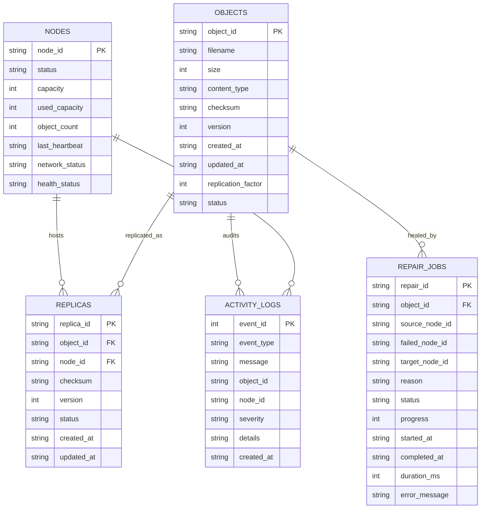

# NexStore VAULT — System Design & Data Models

This document describes the storage node model, object & replica data structures, SQLite WAL database schema, simulated multi-node filesystem isolation, and multi-container/multi-host production deployment topology.

---

## 1. Storage Node Model

Each storage node in **NexStore VAULT** represents an independent fault domain with its own physical directory, capacity quota, heartbeat telemetry, and rack/region metadata.

### Node Attributes (`NodeModel`)
| Field | Type | Description |
| :--- | :--- | :--- |
| `node_id` | `TEXT (PK)` | Unique identifier (`node1`, `node2`, `node3`, `node4`, `node5`). |
| `status` | `NodeStatus` | Operational state: `ONLINE`, `OFFLINE`, `FAILED`, `RECOVERING`, `PARTITIONED`, `REBALANCING`. |
| `capacity` | `INTEGER` | Total byte capacity allocated to the node (default `10 GiB` = `10,737,418,240` bytes). |
| `used_capacity` | `INTEGER` | Current physical/logical bytes stored on the node. |
| `object_count` | `INTEGER` | Number of active object replicas stored on the node. |
| `last_heartbeat` | `TEXT (ISO-8601)` | UTC timestamp (`YYYY-MM-DDTHH:MM:SSZ`) of the last received heartbeat pulse. |
| `network_status` | `TEXT` | Network reachability state: `CONNECTED`, `DISCONNECTED`, or `PARTITIONED`. |
| `health_status` | `TEXT` | Summary health indicator: `HEALTHY`, `WARNING`, or `CRITICAL`. |

---

## 2. Object & Replica Data Models

### 2.1 Object Metadata Model (`ObjectModel`)
An **Object** represents a logical file uploaded by a client, versioned and protected by an authoritative SHA-256 digest.

| Field | Type | Description |
| :--- | :--- | :--- |
| `object_id` | `TEXT (PK)` | Unique identifier (e.g., `obj_8a4f21c90e1b`). |
| `filename` | `TEXT` | Sanitized file name (e.g., `telemetry_dump.json`). |
| `size` | `INTEGER` | Exact payload size in bytes. |
| `content_type` | `TEXT` | MIME type (e.g., `application/pdf`, `image/png`, `text/plain`). |
| `checksum` | `TEXT` | Authoritative 64-character lowercase hex SHA-256 hash. |
| `version` | `INTEGER` | Monotonically increasing version number starting at `1`. |
| `created_at` | `TEXT` | Initial upload timestamp (UTC ISO-8601). |
| `updated_at` | `TEXT` | Last modification/repair timestamp (UTC ISO-8601). |
| `replication_factor` | `INTEGER` | Target replica count (`RF`, default `3`). |
| `status` | `ObjectStatus` | `HEALTHY`, `DEGRADED`, `REPAIRING`, `CORRUPTED`, `UNAVAILABLE`, `REBALANCING`. |

### 2.2 Replica Metadata Model (`ReplicaModel`)
A **Replica** represents a physical copy of an object residing on a specific storage node.

| Field | Type | Description |
| :--- | :--- | :--- |
| `replica_id` | `TEXT (PK)` | Unique identifier (e.g., `rep_4c91b2e01a7d`). |
| `object_id` | `TEXT (FK)` | Foreign key referencing `objects(object_id) ON DELETE CASCADE`. |
| `node_id` | `TEXT (FK)` | Foreign key referencing `nodes(node_id)`. |
| `checksum` | `TEXT` | SHA-256 hash recorded when the replica was written or verified. |
| `version` | `INTEGER` | Replica version number (used to detect `STALE` replicas after partition recovery). |
| `status` | `ReplicaStatus` | `HEALTHY`, `MISSING`, `CORRUPTED`, `STALE`, `REPAIRING`, `UNAVAILABLE`. |

---

## 3. SQLite WAL Metadata Schema

NexStore VAULT persists all cluster state in `data/vault.db` using SQLite with **Write-Ahead Logging (`PRAGMA journal_mode=WAL`)**, `PRAGMA foreign_keys=ON`, and `PRAGMA synchronous=NORMAL`. WAL mode allows concurrent readers to query cluster telemetry without blocking transactional metadata updates.



---

## 4. Simulated Multi-Node Directory Isolation

On a single development or demonstration machine, NexStore VAULT isolates each node's physical storage under `storage_nodes/node{1..5}/`:

```text
storage_nodes/
├── node1/
│   ├── node.json                 # {"node_id": "node1", "region": "us-east-1a", "rack": "rack-01", ...}
│   └── data/
│       ├── obj_8a4f21c90e1b      # Raw binary replica payload
│       └── obj_3f92d0a17b4e
├── node2/
│   ├── node.json                 # {"node_id": "node2", "region": "us-east-1b", "rack": "rack-02", ...}
│   └── data/
...
```

### Atomic Write Guarantee (`backend/storage/file_utils.py`)
Every replica write or inter-node copy follows a strict crash-safe sequence:
1. Write incoming bytes to a hidden staging file `storage_nodes/{node_id}/data/.{object_id}.{uuid}.tmp`.
2. Flush kernel buffers to physical media via `f.flush()` and `os.fsync(f.fileno())`.
3. Atomically replace the destination path via `os.replace(tmp_path, target_path)`.
4. Immediately read back the target file to verify its SHA-256 digest before committing metadata.

---

## 5. Deploying Nodes Across Independent Containers or Physical Hosts

Because all physical file I/O is encapsulated inside `ObjectStore` ([`backend/storage/object_store.py`](file:///d:/hackthon%20antigravity/backend/storage/object_store.py)) and node health/metadata is managed through `NodeManager`, NexStore VAULT can be deployed across independent Docker containers, Kubernetes StatefulSets, or separate Linux VMs in two ways:

### Option A: Shared Network Volume / CSI Mounts per Node Container
Mount each container's dedicated persistent volume (e.g., AWS EBS, Ceph RBD, or NFS export) to `/mnt/storage_nodes/node{i}` and point `STORAGE_ROOT=/mnt/storage_nodes` in `.env`.

### Option B: Multi-Container Microservice Deployment (`docker-compose.yml`)
1. **Coordinator & Metadata Gateway**: Runs the FastAPI control plane (`backend.main:app`), `PlacementEngine`, `RepairManager`, and PostgreSQL/SQLite metadata store.
2. **Storage Node Daemons (`node1`..`node5`)**: Each node runs a lightweight FastAPI/gRPC storage agent exposing:
   - `PUT /internal/blobs/{object_id}` (atomic write + return SHA-256)
   - `GET /internal/blobs/{object_id}` (stream replica bytes)
   - `DELETE /internal/blobs/{object_id}` (remove replica)
   - `GET /internal/heartbeat` (report disk usage & liveness)
3. **Adapter Swap**: Replace `ObjectStore.write_replica_bytes` and `ObjectStore.read_replica_bytes` with asynchronous `httpx.AsyncClient` calls targeting `http://node{i}.vault.internal:8000/internal/blobs/{object_id}`. All higher-level services (`UploadService`, `DownloadService`, `RepairManager`, `Rebalancer`, and `ConsistencyManager`) remain 100% unchanged.
